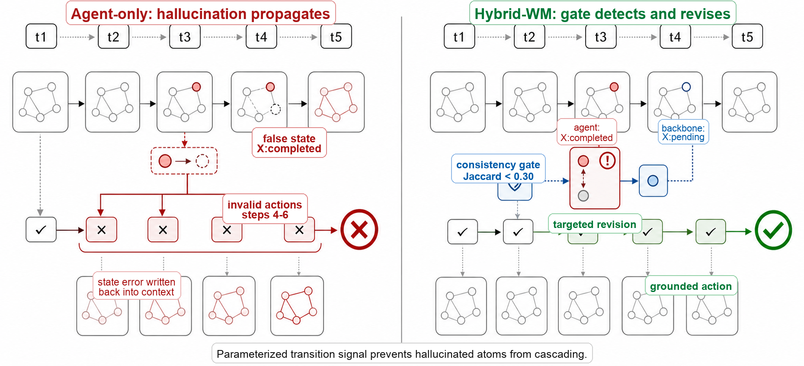

<div align="center">

# Agent vs. Parametric World Models

### Hybrid Planning for Reliable Language Agents

**Xinyuan Song, Zekun Cai**

[](https://github.com/Hik289/Agent-vs-param)
[](https://arxiv.org/abs/2606.27806)
[](LICENSE)

Research code and paper artifacts for studying how language-agent world models
and parametric world models fail, complement each other, and can be combined.

</div>

---

## Overview

Language agents do more than choose actions. During planning, they also write
implicit predictions of how the world will change. These imagined state updates
make agents flexible, but they introduce a failure mode that ordinary transition
losses do not capture: a hallucinated state claim can be written into context and
then reused for many later decisions.

Parametric world models have the opposite profile. Their transition errors are
measurable with validity, delta, value, risk, and node-state metrics, but they
are usually weaker semantic planners. This project studies that tradeoff in
graph-structured planning environments and evaluates **Hybrid World-Model
Planning (Hybrid-WM)**.

Hybrid-WM keeps the LLM as the semantic planner and uses a small parametric
transition model as a grounding signal. At each step, the backbone predicts
action validity, state deltas, risk, and value. A consistency gate compares the
agent's imagined delta with the parametric delta and triggers a targeted
revision only when they disagree.

In the current manuscript:

| Result | Reported value |
|--------|----------------|
| Live GPT-4o-mini hallucinated-state rate | `0.176 -> 0.035` |
| Simulator success, Agent-Replan to Hybrid-WM | `0.668 -> 0.838` |
| Long-horizon success, `H > 10` | `0.471 -> 0.758` |
| Hallucinated-state rate, main simulator | `0.205 -> 0.079` |
| Mean propagation depth | `2.45 -> 1.51` |

---

## Main Intuition

The figure below is included in the paper as `fig_intuition_gemini.pdf`.

<p align="center">
  
</p>

PDF version: [`figures/fig_intuition_gemini.pdf`](figures/fig_intuition_gemini.pdf)

The example shows the central mechanism: an agent-only world model can mark a
node complete even when the environment leaves it pending. That false state atom
then causes invalid downstream actions. Hybrid-WM detects the mismatch between
the agent's imagined state delta and the parametric backbone's predicted delta,
then asks for a targeted correction before the hallucination propagates.

---

## Method Summary

| Regime | Role in the paper |
|--------|-------------------|
| **Agent world model** | The LLM reasons over goals and writes imagined state deltas. It is semantically strong but can hallucinate state changes. |
| **Parametric world model** | A trained transition predictor estimates action validity, next-state deltas, risk, and value. It is auditable but weaker as a standalone planner. |
| **Hybrid-Full** | Provides the LLM with a parametric skeleton for action selection. |
| **Hybrid-WM** | Adds a consistency gate and targeted revision to reduce hallucinated state propagation. |
| **Hybrid-WM+Verifier** | Adds a verifier on top of Hybrid-WM for stricter invalid-action control. |

Hybrid-WM has four phases:

1. **Skeleton scoring:** the parametric backbone scores valid actions, deltas,
   value, risk, and affected entities.
2. **Agent draft:** the LLM selects an action and writes an imagined state
   delta in structured JSON.
3. **Consistency gate:** a Jaccard check compares the agent delta with the
   backbone delta.
4. **Targeted revision and risk gating:** only low-consistency or high-risk
   steps receive a correction message.

---

## Metrics

The paper separates final task success from world-model faithfulness.

| Metric | Meaning |
|--------|---------|
| `SR` | task success rate |
| `SR-long` | success on long-horizon tasks |
| `IAR` | invalid-action rate |
| `HSR` | hallucinated-state rate |
| `PD` | propagation depth of hallucinated atoms |
| `RWF` | risk-weighted failure |
| `Tok/Succ` | tokens per successful episode |
| `CER` | correction error rate |

This distinction matters because an agent can complete some short tasks while
still writing false state transitions that hurt longer rollouts.

---

## Repository Contents

This public snapshot contains the graph-world evaluation harness, LLM agent
runner, baseline policies, scoring utilities, and reproduction scripts used by
the project.

| Component | Location | Purpose |
|-----------|----------|---------|
| Environments | `src/environments/` | Object-state, graph-navigation, and tool-DAG worlds. |
| Agents | `src/agents/` | LLM prompts, parsing, and API wrappers. |
| Methods | `src/methods/` | Planning, probing, and oracle-style baselines used by the harness. |
| Metrics | `src/metrics/` | Belief, task-success, drift, and aggregate scoring. |
| Scripts | `src/scripts/` | Smoke tests, anchor checks, main experiment runner, and diagnostics. |
| Registry | `cells_registry.csv` | Experiment cells for environments, methods, stress settings, and seeds. |
| Figures | `figures/` | Paper figures, including `fig_intuition_gemini.pdf`. |
| Examples | `examples/` | Shell entry points for smoke and reproduction runs. |

---

## Installation

```bash
git clone git@github.com:Hik289/Agent-vs-param.git
cd Agent-vs-param

python3 -m venv .venv
source .venv/bin/activate
pip install -r requirements.txt

export OPENAI_API_KEY=sk-...        # required for GPT-based agents
export ANTHROPIC_API_KEY=...        # optional, for Anthropic/Judge variants
```

The default model in `config.yaml` is `gpt-4o-mini`.

---

## Quickstart

Run a small end-to-end smoke test:

```bash
bash examples/smoke_test.sh
```

Or run one explicit cell:

```bash
python -m src.scripts.run_smoke \
    --env ToolDAGWorld \
    --method no_probe \
    --stress S2 \
    --n-seeds 1 \
    --prefix smoke
```

Run deterministic and oracle sanity checks:

```bash
python src/scripts/anchor_3_determinism.py
python src/scripts/anchor_4_oracle_self_check.py
```

---

## Reproducing Experiment Grids

The included registry defines environment, stress, method, and seed grids:

```bash
python -m src.scripts.run_main \
    --registry cells_registry.csv \
    --layer r3_stage_d \
    --prefix r3_stage_d \
    --parallel 8
```

The example script runs a broader reproduction pipeline:

```bash
bash examples/reproduce_main.sh
```

Outputs are written under `experiments/` and `logs/`. API-backed runs may incur
LLM cost depending on the selected model, registry layer, and rate limits.

---

## Directory Structure

```text
Agent-vs-param/
|-- README.md
|-- LICENSE
|-- requirements.txt
|-- config.yaml
|-- cells_registry.csv
|-- figures/
|   |-- fig_intuition_gemini.pdf
|   `-- fig_intuition_gemini.png
|-- examples/
|   |-- smoke_test.sh
|   `-- reproduce_main.sh
`-- src/
    |-- agents/
    |-- environments/
    |-- methods/
    |-- metrics/
    |-- scripts/
    |-- tests/
    `-- utils/
```

---

## Citation

If you use this code or figure, please cite:

```bibtex
@misc{song2026groundediterativelanguageplanning,
      title={Grounded Iterative Language Planning: How Parameterized World Models Reduce Hallucination Propagation in LLM Agents}, 
      author={Xinyuan Song and Zekun Cai},
      year={2026},
      eprint={2606.27806},
      archivePrefix={arXiv},
      primaryClass={cs.AI},
      url={https://arxiv.org/abs/2606.27806}, 
}
```

## License

Released under the [MIT License](LICENSE). Third-party models, APIs, and
benchmarks used by the experiments are governed by their own licenses and terms.
